# 优化模型——数学规划
## 线性规划
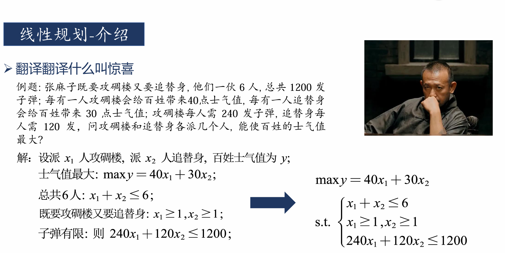
```python
from scipy.optimize import minimize

def func4():
    '''
    使用 minimize 函数进行线性规划
    :return: None
    '''
    # 定义目标函数的系数
    # 目标函数形式为: -40*x0 - 30*x1
    c = [-40, -30]

    # 定义等式约束条件的函数
    # 等式约束形式为: x0 + x1 = 6
    def eq_constraint(x):
        return x[0] + x[1] - 6

    # 定义不等式约束条件的函数
    # 不等式约束形式为: 240*x0 + 120*x1 <= 1200
    def ineq_constraints(x):
        return [1200 - 240*x[0] - 120*x[1]]  # 确保该值非负

    # 定义变量的边界
    # x0 和 x1 的取值范围均在 [1, 6] 之间
    bounds = [(1, 6), (1, 6)]

    # 初始猜测值
    # 从 [1, 1] 开始优化，初始值应在边界范围内
    x0 = [1, 1]

    # 使用 minimize 函数进行线性规划
    # lambda x: c[0] * x[0] + c[1] * x[1] 定义了目标函数: -40*x0 - 30*x1
    # constraints 指定了约束条件，其中 type 为 'eq' 表示等式约束，
    # 'ineq' 表示不等式约束
    # bounds 限制了变量的取值范围
    # method='SLSQP' 选择了 Sequential Least Squares Quadratic Programming 方法
    res = minimize(lambda x: c[0] * x[0] + c[1] * x[1], x0,
                   constraints=[{'type': 'eq', 'fun': eq_constraint},
                                {'type': 'ineq', 'fun': ineq_constraints}],
                   bounds=bounds,
                   method='SLSQP')  # 可选方法: highs, COBYLA, L-BFGS-B

    # 打印结果
    print('最小值:', res.fun)  # 打印最小值，即目标函数的最优值
    print('最优解:', res.x)    # 打印最优解，即变量 x0 和 x1 的最优值


```

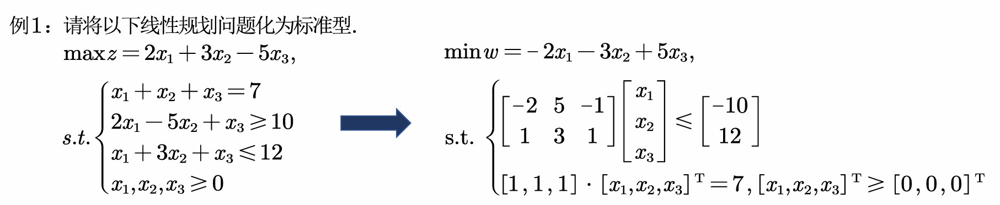

```python
def func5():
    '''
    用minimize函数做线性规划,更强
    :return:
    '''
    # 定义目标函数的系数
    c = [-2, -3, 5]

    # 定义等式约束条件的函数
    def eq_constraint(x):
        return x[0] + x[1] + x[2] - 7

    # 定义不等式约束条件的函数
    def ineq_constraints(x):
        return [-10 + 2*x[0] - 5*x[1] + x[2],  # -2*x1 + 5*x2 - x3 <= -10
                12-x[0] - 3*x[1] - x[2]]  # x1 + 3*x2 + x3 <= 12

    # 定义变量的边界
    bounds = [(0, None), (0, None), (0, None)]  # 对 x1 x2 x3 的边界，它们都大于等于0，但是没有上界

    # 初始猜测值
    x0 = [0, 0, 0]


    # 使用 minimize 函数进行线性规划
    #lambda x: c[0] * x[0] + c[1] * x[1] + c[2] * x[2]实际就是目标函数：−2X0−3X1+5X2
    res = minimize(lambda x: c[0] * x[0] + c[1] * x[1] + c[2] * x[2], x0,
                   constraints=[{'type': 'eq', 'fun': eq_constraint},
                                {'type': 'ineq', 'fun': ineq_constraints}],
                   bounds=bounds,
                   method='SLSQP') #它提供了多种求解算法，如highs、SLSQP、COBYLA、L-BFGS-B等，你可以试试有什么效果

    # 打印结果
    print('最小值:', res.fun)
    print('最优解:', res.x)
```
输出结果：


## 整数规划
### 01背包问题
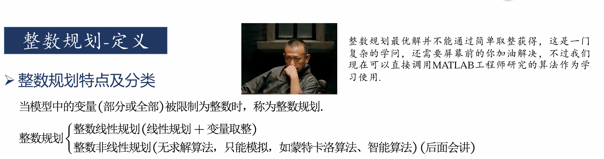
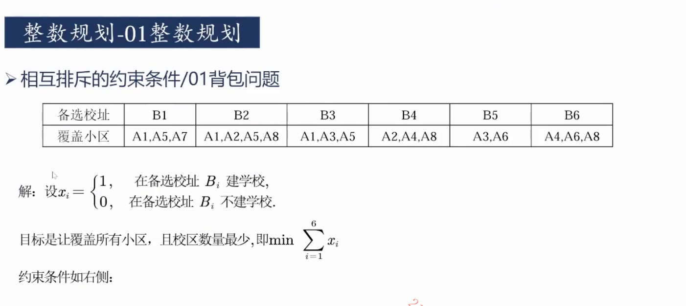
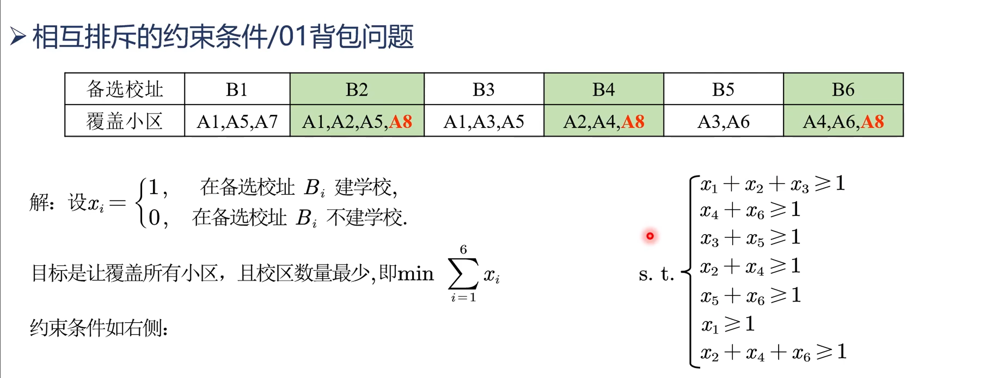
约束条件这样得到:保证A1被覆盖，那么B1,B2,B3至少有一个被选中，因此X1+X2+X3>=1
代码实现:
```python
from pulp import LpMinimize, LpProblem, LpVariable, lpSum


def func6():
    '''
    整数规划示例：最小化目标函数
    这个函数定义并解决了一个0-1背包问题。
    '''
    # 创建一个LP问题，目标是最小化
    problem = LpProblem("Knapsack_Problem", LpMinimize)

    # 定义0-1整数变量
    x = [LpVariable(f'x{i}', cat='Binary') for i in range(6)]  # 6个0-1变量 x0 到 x5

    # 定义目标函数
    problem += lpSum(x), "Objective Function"
    # 目标函数是 x0 + x1 + x2 + x3 + x4 + x5，我们希望最小化这个目标函数

    # 添加约束条件
    problem += x[0] + x[1] + x[2] >= 1
    # 约束条件1：x0 + x1 + x2 >= 1

    problem += x[2] + x[4] >= 1
    # 约束条件2：x2 + x4 >= 1

    problem += x[3] + x[5] >= 1
    # 约束条件3：x3 + x5 >= 1

    problem += x[4] + x[5] >= 1
    # 约束条件4：x4 + x5 >= 1

    problem += x[0] >= 1
    # 约束条件5：x0 >= 1

    problem += x[1] + x[3] + x[5] >= 1
    # 约束条件6：x1 + x3 + x5 >= 1

    problem += lpSum(x) <= 6
    # 约束条件7：x0 + x1 + x2 + x3 + x4 + x5 <= 6

    # 解决问题
    problem.solve()

    # 打印结果
    print("最优解:")
    for i in range(6):
        print(f"x{i} =", x[i].varValue)
    # 打印每个变量的最优值

    print("最优值:", problem.objective.value())
    # 打印目标函数的最优值


if __name__ == '__main__':
    func6()
```
运行结果：
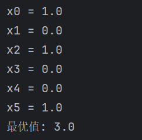
### 指派问题
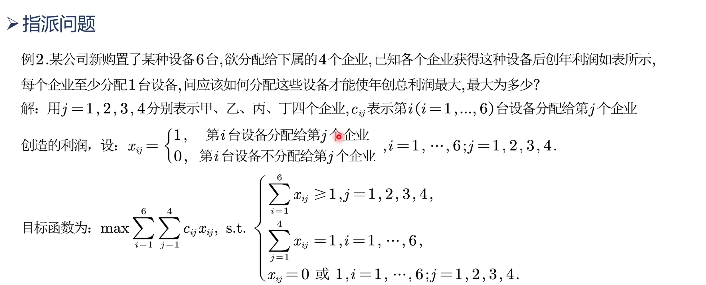
第一个约束条件：保证每个企业至少有1台设备
第二个约束条件：保证每台设备只被分配1次
代码实现：
```python
from pulp import LpMaximize, LpProblem, LpVariable, lpSum, value, LpStatus

# 利润矩阵
profits = [
    [4, 2, 3, 4],  # 1号设备的利润
    [6, 4, 5, 5],  # 2号设备的利润
    [7, 6, 7, 6],  # 3号设备的利润
    [7, 8, 8, 6],  # 4号设备的利润
    [7, 9, 8, 6],  # 5号设备的利润
    [7, 10, 8, 6]  # 6号设备的利润
]

# 定义模型
model = LpProblem("Maximize_Profit", LpMaximize)

# 企业和设备编号
enterprises = ["甲", "乙", "丙", "丁"]
devices = [1, 2, 3, 4, 5, 6]

# 创建决策变量
x = LpVariable.dicts("x", (devices, enterprises), cat='Binary')

# 将企业编号映射到整数索引
enterprise_index = {enterprise: i for i, enterprise in enumerate(enterprises)}

# 目标函数：最大化总利润
model += lpSum(profits[device-1][enterprise_index[enterprise]] * x[device][enterprise] for device in devices for enterprise in enterprises)

# 约束条件：每个设备只能分配给一个企业
for device in devices:
    model += lpSum(x[device][enterprise] for enterprise in enterprises) == 1

# 约束条件：每个企业至少分配1台设备
for enterprise in enterprises:
    model += lpSum(x[device][enterprise] for device in devices) >= 1

# 求解模型
model.solve()

# 输出结果
print(f"最大利润: {value(model.objective)}")
print(f"模型状态: {LpStatus[model.status]}")
for device in devices:
    for enterprise in enterprises:
        if value(x[device][enterprise]) == 1:
            print(f"设备{device} 分配给 企业{enterprise}")

```
运行结果：
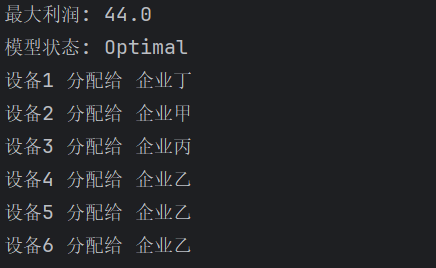
### 两种01问题的区别于联系：
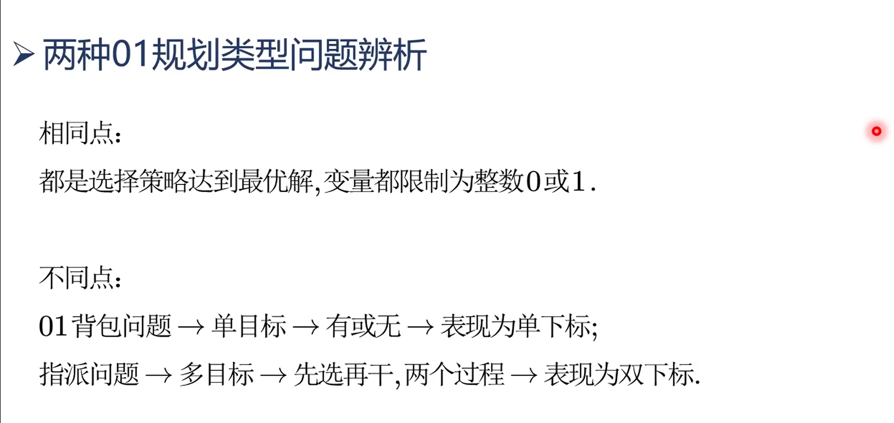
### 蒙特卡洛模拟
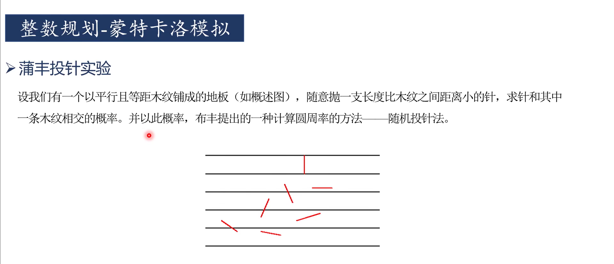
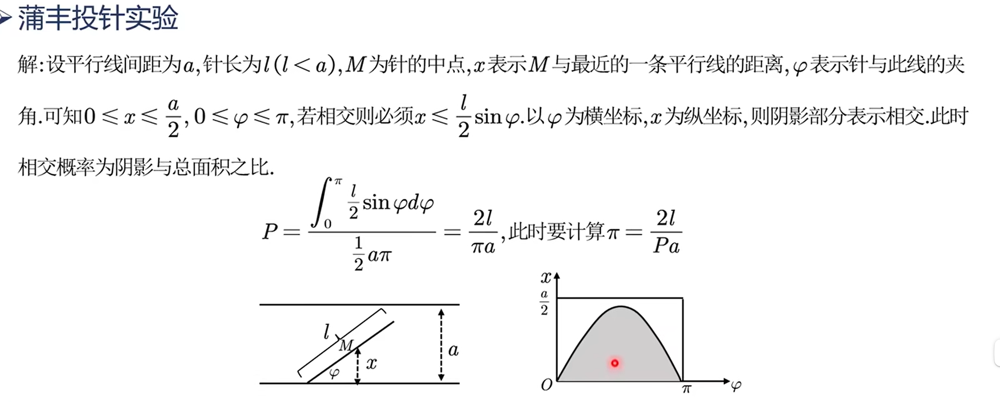
代码实现之matlab：
````matlab
%% 蒙特卡洛模拟
clear;clc
a = 10;
L = 5;
n = 10000; %抛掷次数，设为1000次
% 随机抛针，得到的角度
ph = rand(n,1) * pi;   %rand(n,1)即生成了n个从0到1的数。这里生成了1000个从0到1的随机数，乘以pi就是——投了1000次，产生的1000个随机夹角。
x = rand(n,1) * a/2;  %产生了1000个随机距离。距离指的是针的中点到最近的平行线的垂直距离。
m = 0; %相交次数
y = (L/2) * sin(ph); %恰好相交的边界情况
axis([0,pi, 0,a/2]); %先设置坐标轴
box on; % 让图hold住不要动，否则会绘制一个新的图
for i = 1 : n    %如果x小于等于y，那么一定相交
    if(x(i) <= y(i))
        m = m + 1;
        plot(ph(i),x(i),'b.');
        hold on;
    end
end
P = m/n;  %通过相交次数和抛针总次数，可以得出相交的概率
mypi = 2*L/(P*a)  %这个公式是由概率论导出的，由此可以得出圆周率pi的值
````
运行结果：
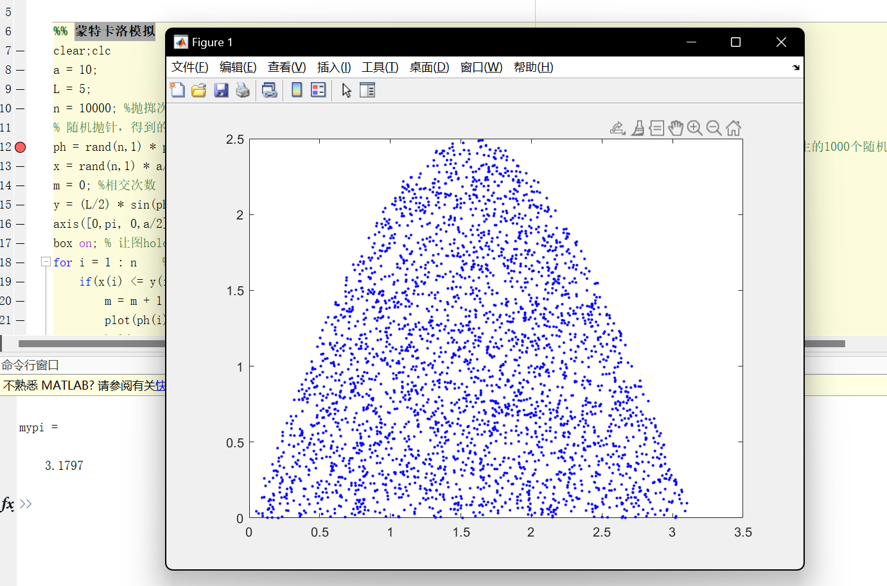
代码实现之python：
```python
import random
import math
import matplotlib.pyplot as plt
from matplotlib.font_manager import FontProperties

# 设置中文字体，以确保中文标签能够正确显示
font = FontProperties(fname='C:/Windows/Fonts/simhei.ttf')  # 使用黑体，确保路径正确


def buffon_needle_simulation_plot(a, L, n):
    """
    蒲丰投针实验模拟函数，通过模拟抛掷针计算圆周率，并生成图形。

    参数：
    a - 平行线之间的距离
    L - 针的长度
    n - 抛掷次数

    返回值：
    estimated_pi - 估算的圆周率
    """
    # 生成 n 个随机角度，范围在 [0, pi] 之间
    angles = [random.uniform(0, math.pi) for _ in range(n)]

    # 生成 n 个随机距离，范围在 [0, a / 2] 之间
    distances = [random.uniform(0, a / 2) for _ in range(n)]

    # 计算每个角度对应的边界值，边界值公式为 (L / 2) * sin(角度)
    y = [(L / 2) * math.sin(angle) for angle in angles]

    # 初始化相交次数计数器
    intersections = 0

    # 设置绘图窗口的大小
    plt.figure(figsize=(10, 5))

    # 遍历每一个随机生成的角度和距离
    for i in range(n):
        # 如果距离小于等于计算出的边界值，则表示针与平行线相交
        if distances[i] <= y[i]:
            intersections += 1
            # 绘制每次相交的点，颜色为蓝色，点的大小为1
            plt.plot(angles[i], distances[i], 'b.', markersize=1)

    # 计算相交的概率 P
    P = intersections / n
    # 使用公式 2 * L / (P * a) 估算圆周率 π 的值
    estimated_pi = 2 * L / (P * a)

    # 绘制相交边界线，这里绘制底部的水平线
    plt.axhline(y=0, color='r', linestyle='-', label='相交边界')  # 红色直线表示相交边界

    # 设置图表的 x 轴标签
    plt.xlabel('角度（弧度）', fontproperties=font)
    # 设置图表的 y 轴标签
    plt.ylabel('距离最近线的距离', fontproperties=font)
    # 设置图表的标题
    plt.title('蒲丰投针实验模拟', fontproperties=font)
    # 显示图例
    plt.legend(prop=font)
    # 显示网格线
    plt.grid(True)
    # 设置坐标轴的范围
    plt.axis([0, math.pi, 0, a / 2])

    # 绘制图像
    plt.draw()
    # 暂停以确保图表可以显示
    plt.pause(0.1)

    # 返回估算的圆周率值
    return estimated_pi


# 参数设置
a = 10  # 平行线之间的距离
L = 5  # 针的长度
n = 10000  # 抛掷次数

# 运行模拟并绘制结果
estimated_pi = buffon_needle_simulation_plot(a, L, n)

# 输出估算的圆周率
print(f"通过蒲丰投针实验估计的圆周率: {estimated_pi:.4f}")

# 保持图形窗口打开，直到用户手动关闭
plt.show()

```
输出结果：
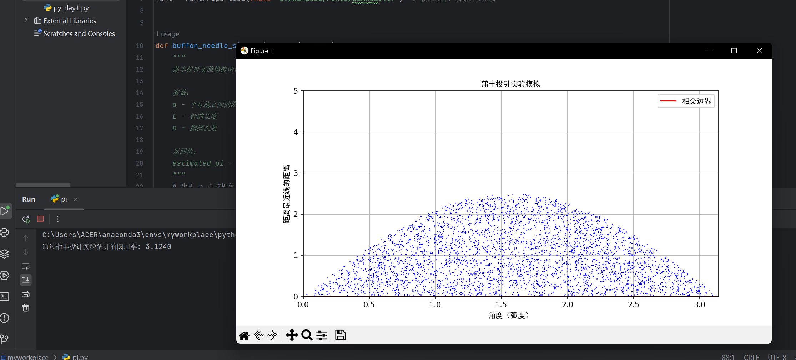

## 非线性规划
和线性规划是一模一样的思路，代码也大差不差，只是约束条件是非线性的而已
