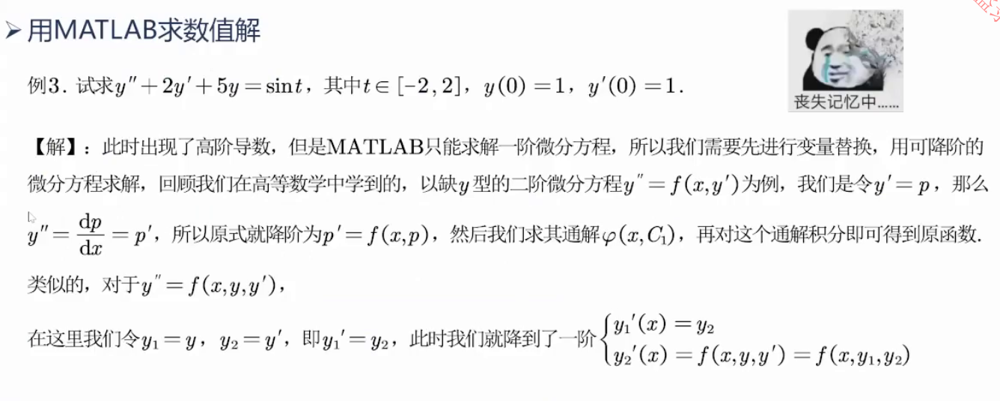
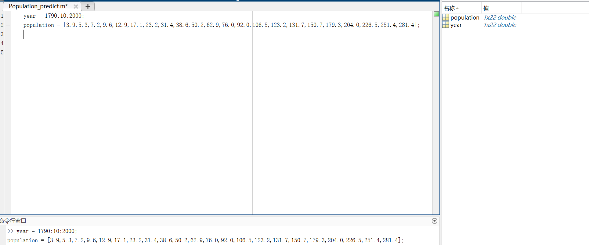
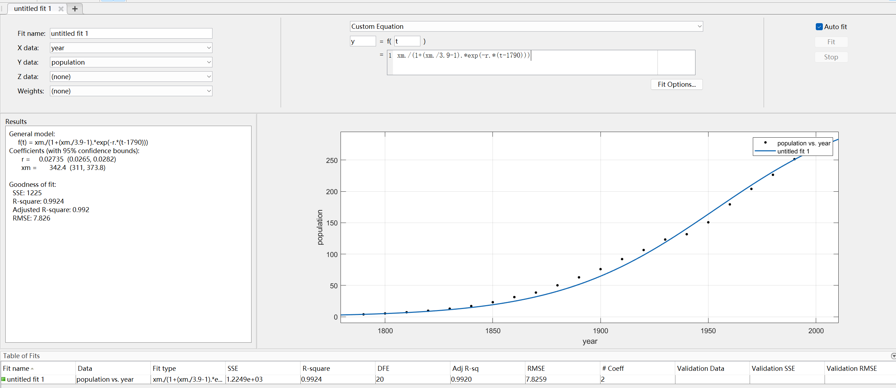

# 微分方程


## 求积分
 ```python
import numpy as np
from scipy.integrate import odeint
 def func16():
    # 定义被积函数
    def integrand(x):
        return x ** 2

    # 定义积分区间
    a = 0  # 下限
    b = 1  # 上限

    # 进行积分计算
    result, error = quad(integrand, a, b) # 要先导入这个包：from scipy.integrate import quad   ； quad是python计算一维积分的函数，会返回两个值，一个是计算结果，另一个是计算误差

    # 显示结果
    print("积分结果:", result)
    print("估计误差:", error)
 ```
输出结果：

### 一阶微分方程求解
#### 例题1

代码实现：
```python
import numpy as np
from scipy.integrate import odeint

# 定义微分方程
def model(y, x):
    return np.exp(x)  # y' = e^x

# 定义初始条件
y0 = 1  # 初始条件 y(0) = 1

# 定义自变量范围
x = np.linspace(0, 2, 10)  # 从0到2之间取101个点

# 使用 odeint 求解微分方程
y_numerical = odeint(model, y0, x)

# 输出数值解（x, y）的形式
print("x, y values:")
for xi, yi in zip(x, y_numerical.flatten()):
    print(f"({xi:.4f}, {yi:.4f})")
```
运行结果：
(0.0000, 1.0000)
(0.2222, 1.2488)
(0.4444, 1.5596)
(0.6667, 1.9477)
(0.8889, 2.4324)
(1.1111, 3.0377)
(1.3333, 3.7937)
(1.5556, 4.7377)
(1.7778, 5.9167)
(2.0000, 7.3891)

#### 例题2

代码实现:
```python
from scipy.optimize import linprog
from scipy.optimize import minimize
from pulp import LpMaximize, LpProblem, LpVariable
import networkx as nx
import matplotlib.pyplot as plt
import pandas as pd
from scipy.integrate import quad
from scipy.optimize import curve_fit
from scipy.integrate import odeint
import seaborn as sns
import numpy as np   #以上是导入必须的算法库

plt.rcParams['font.sans-serif'] = ['Simhei']  # 显示中文
plt.rcParams['axes.unicode_minus'] = False  # 显示负号

def func19():
    # 定义微分方程
    def model(y, x):
        dydx = -y  # 这里的微分方程是 y' = -y
        return dydx

    # 定义初始条件
    y0 = 1

    # 定义时间点
    x = np.linspace(0, 5, 101)

    # 求解微分方程
    y = odeint(model, y0, x)

    # 绘制结果
    plt.plot(x, y)
    plt.xlabel('x')
    plt.ylabel('y')
    plt.title("Solution of the Differential Equation y' = -y")
    plt.show()
```

运行结果：

#### 例题3
、
代码实现：
```python

def func20():
    def dy_dt(y, t):  # 定义函数 f(y,t)
        return np.sin(t ** 2)  # 明确了这个微分方程为dy/dt=sin(t^2)
    y0 = [1]  # y0 = 1 也可以, 这明确了初值
    t = np.arange(-10, 10, 0.01)  # (start,stop,step)
    y = odeint(dy_dt, y0, t)  # 求解微分方程初值问题

    # 绘图
    plt.plot(t, y)
    plt.title("scipy.integrate.odeint")
    plt.show()

```
运行结果：


#### 例题4（多元方程求解）
<br/>


该模型有一个特点，对起点特别敏感。对于确定的函数而言，参数都一样，选定不同的起点，发现绘制图像也千差万别，这就是为什么天气难以预测的根源。

代码实现:
```python
from scipy.optimize import linprog
from scipy.optimize import minimize
from pulp import LpMaximize, LpProblem, LpVariable
import networkx as nx
import matplotlib.pyplot as plt
import pandas as pd
from scipy.integrate import quad
from scipy.optimize import curve_fit
from scipy.integrate import odeint
import seaborn as sns
import numpy as np   #以上是导入必须的算法库


plt.rcParams['font.sans-serif'] = ['Simhei']  # 显示中文
plt.rcParams['axes.unicode_minus'] = False  # 显示负号
def func21():
    # 定义洛伦兹吸引子的微分方程
    def lorenz_system(state, t, sigma, rho, beta):
        x, y, z = state
        dxdt = sigma * (y - x)
        dydt = x * (rho - z) - y
        dzdt = x * y - beta * z
        return [dxdt, dydt, dzdt]

    # 定义参数值
    sigma = 10
    rho = 28
    beta = 8 / 3

    # 定义初始条件
    initial_state = [1.0, 0.0, 0.0]

    # 定义时间点
    t = np.linspace(0, 50, 10000)

    # 求解微分方程
    solution = odeint(lorenz_system, initial_state, t, args=(sigma, rho, beta))  
    # args这个参数指的是将参数传入我们自己定义好的函数中，这里是将sigma, rho, beta传入lorenz_system

    # 提取解的分量,进行转置
    x, y, z = solution.T

    # 绘制轨迹
    fig = plt.figure()
    ax = fig.add_subplot(111, projection='3d')
    ax.plot(x, y, z, lw=0.5)
    ax.set_xlabel('X')
    ax.set_ylabel('Y')
    ax.set_zlabel('Z')
    ax.set_title('Lorenz Attractor')
    plt.show()
```

运行结果：


### 高阶微分方程求解
<br/>

离不开降阶


#### 例题1

```matlab


% 定义二阶微分方程的函数句柄
% y'' + 2*y' + 5*y = sin(t)
% 降阶为一阶微分方程组：
% 设 v = y'
% 那么 y'' = v'
% 所以 v' = sin(t) - 2*v - 5*y

% 定义微分方程的函数句柄 f(t, y)
% y 是一个包含两个元素的向量，其中
% y(1) 代表 y(t)，
% y(2) 代表 y'(t) 即 v(t)
f = @(t, y) [y(2); sin(t) - 2*y(2) - 5*y(1)];

% 定义时间范围和初始条件
tspan = [-2 2]; % 时间范围 t 从 -2 到 2
y0 = [1; 1]; % 初始条件 [y(0), y'(0)]，即 [1, 1]

% 使用 ode45 求解一阶微分方程组
% ode45 是 MATLAB 中的一个求解常微分方程的函数
% [t, y] 是求解的时间向量和解矩阵
[t, y] = ode45(f, tspan, y0);

% 解析解计算（假设已知解析解函数 y_analytical）
% 如果有解析解函数，可以计算解析解并进行比较
% 例如，假设解析解函数为：
% y_analytical = @(t) (1/26) * (5 * sin(t) + 6 * cos(t) - 2 * sin(t) - 6 * cos(t));
% 计算解析解的值
% y_analytical_values = y_analytical(t);

% 计算残差
% 计算残差以评估数值解的准确性
% 残差 = 实际右侧 - 数值解右侧
residual = y(:,2) - (sin(t) - 2 * y(:,2) - 5 * y(:,1));
max_residual = max(abs(residual)); % 计算最大残差

% 输出初始条件
% 显示在时间 t=0 时的 y(0) 和 y'(0) 的值
disp(['Initial condition y(0): ', num2str(y(1,1))]);
disp(['Initial condition y''(0): ', num2str(y(1,2))]);

% 输出最大残差
% 显示计算出的最大残差值
disp(['Maximum residual: ', num2str(max_residual)]);

% 绘制结果
% 使用 plot 函数绘制 y(t) 和 y'(t) 的图像
figure;
plot(t, y(:,1), '-o', t, y(:,2), '-x'); % 绘制 y(t) 和 y'(t)
xlabel('Time t'); % x 轴标签
ylabel('Solutions y and y'''); % y 轴标签
legend('y(t)', 'y''(t)'); % 图例
title('Solution of the ODEs'); % 图标题
```
输出结果：


#### 例题2
<br/>


代码实现：
```python

import matplotlib.pyplot as plt
from scipy.integrate import odeint
import numpy as np
#以上是导入必须的算法库


plt.rcParams['font.sans-serif'] = ['Simhei']  # 显示中文
plt.rcParams['axes.unicode_minus'] = False  # 显示负号
def func22():
    # 导数函数，求 Y=[u,v] 点的导数 dY/dt
    def deriv(Y, t, a, w): # a，w都是微分方程的常系数
        u, v = Y  # Y=[u,v]
        dY_dt = [v, -2 * a * v - w * w * u]  # 因为是缺x形的二阶微分方程，因此使用降阶，可化为两个1阶方程
        return dY_dt

    t = np.arange(0, 20, 0.01)  # 创建时间点 (start,stop,step)
    # 设置导数函数中的参数 (a, w)，题目背景会告诉什么是过阻尼，欠阻尼，临界阻尼
    paras1 = (1, 0.6)  # 过阻尼：a^2 - w^2 > 0
    paras2 = (1, 1)  # 临界阻尼：a^2 - w^2 = 0
    paras3 = (0.3, 1)  # 欠阻尼：a^2 - w^2 < 0

    # 调用ode对进行求解, 用两个不同的初始值 W1、W2 分别求解
    Y0 = (1.0, 0.0)  # 定义初值为 Y0=[u0,v0]
    Y1 = odeint(deriv, Y0, t, args=paras1)  # args 设置导数函数的参数
    Y2 = odeint(deriv, Y0, t, args=paras2)  # args 设置导数函数的参数
    Y3 = odeint(deriv, Y0, t, args=paras3)  # args 设置导数函数的参数
    # W2 = (0.0, 1.01, 0.0)  # 定义初值为 W2
    # track2 = odeint(lorenz, W2, t, args=paras)  # 通过 paras 传递导数函数的参数

    # 绘图
    plt.plot(t, Y1[:, 0], 'r-', label='u1(t)')
    plt.plot(t, Y2[:, 0], 'b-', label='u2(t)')
    plt.plot(t, Y3[:, 0], 'g-', label='u3(t)')
    plt.plot(t, Y1[:, 1], 'r:', label='v1(t)')
    plt.plot(t, Y2[:, 1], 'b:', label='v2(t)')
    plt.plot(t, Y3[:, 1], 'g:', label='v3(t)')
    plt.axis([0, 20, -0.8, 1.2])
    plt.legend(loc='best')
    plt.title("Second ODE by scipy.integrate.odeint")
    plt.show()
```
运行结果：


#### 例题3 求长度
<br/>


代码实现：
```python
import numpy as np
from scipy.integrate import odeint
import matplotlib.pyplot as plt

# 定义微分方程组
def system(variables, x):
    """
    定义微分方程组
    :param variables: 包含 y 和 v 的列表
    :param x: 自变量
    :return: 微分方程的解
    """
    y, v = variables  # 从输入的变量中解包 y 和 v
    dydx = v  # y 关于 x 的导数等于 v
    dvdx = np.sqrt(1 + v**2) / (2 * x)  # v 关于 x 的导数，基于给定的微分方程
    return [dydx, dvdx]

# 初始条件
y0 = 0  # x=16 时 y 的初始值
v0 = 0  # x=16 时 v 的初始值
initial_conditions = [y0, v0]  # 初始条件的列表

# 定义x的范围
x_values = np.arange(16, 0.1, -0.04)  # 从 16 到 0.1，步长为 -0.04 的 x 值数组

# 求解微分方程组
solution = odeint(system, initial_conditions, x_values)
# odeint 函数用于求解微分方程组，返回的 solution 包含 y 和 v 的解

# 提取解
y_solution = solution[:, 0]  # 从 solution 中提取 y 的解
v_solution = solution[:, 1]  # 从 solution 中提取 v 的解

# 绘图
plt.figure()  # 创建一个新的绘图窗口
plt.plot(x_values, y_solution, label='y(x)')  # 绘制 y 关于 x 的图像
plt.xlabel('x')  # x 轴标签
plt.ylabel('y')  # y 轴标签
plt.title('y(x) 关系图')  # 图形标题
plt.legend()  # 显示图例
plt.grid()  # 显示网格
plt.show()  # 显示图形

```

运行结果:


###  人口预测模型 
<br/>


<br/>


代码实现：
首先导入数据
```matlab
year = 1790:10:2000;
population = [3.9,5.3,7.2,9.6,12.9,17.1,23.2,31.4,38.6,50.2,62.9,76.0,92.0,106.5,123.2,131.7,150.7,179.3,204.0,226.5,251.4,281.4];
```
运行结果:

接下来使用工具进行拟合，matlab的拟合工具也提供了自定义函数模块

可以看到拟合效果很好，将参数记下后，构成预测函数，并与已有数据进行比对
 ```matlab
year = 1790:10:2000;
population = [3.9,5.3,7.2,9.6,12.9,17.1,23.2,31.4,38.6,50.2,62.9,76.0,92.0,106.5,123.2,131.7,150.7,179.3,204.0,226.5,251.4,281.4];
plot(year, population, '-');
hold on;
r = 0.02735
xm = 342.4
t = [2000:2010];
y = xm./(1+(xm./3.9-1).*exp(-r.*(t-1790)))
plot(t,y,'-');
```
运行结果：

拟合效果良好，接下来可以进行预测，仅需修改函数的自变量取值范围即可
```matlab
year = 1790:10:2000;
population = [3.9,5.3,7.2,9.6,12.9,17.1,23.2,31.4,38.6,50.2,62.9,76.0,92.0,106.5,123.2,131.7,150.7,179.3,204.0,226.5,251.4,281.4];
plot(year, population, '-');
hold on;
r = 0.02735
xm = 342.4
t = [2000:2050];
y = xm./(1+(xm./3.9-1).*exp(-r.*(t-1790)))
plot(t,y,'-');
```
运行结果：


### 捕食者与食饵模型（灵活搭配可得到其他种群关系）
<br/>


规律如下图：


和平年代，开始捕捞时，平衡点发生变化：食饵的增长率下降。

和平年代，也是如此。


因此，食饵减小，捕食者增加了。

代码实现：
```matlab
%自己定义好的函数
function dy = pre_war(t,y)   %定义了系数、初值、具体微分方程。
    r = 1;d = 0.5; a = 0.1; b = 0.02;
    dy=zeros(2,1); 
    dy(1) = (r-a*y(2))*y(1);
    dy(2) = -1*(d-b*y(1))*y(2);
end
```
```matlab
%主执行脚本
%% 先试试用符号解
r = 1;d = 0.5; a = 0.1; b = 0.02;
syms x(t) y(t) % 定义符号变量，x(t)和y(t)都是关于t的函数
%微分方程：x'(t) = (r-a*y)*x, y'(t) = -(d-b*x)*y
eq1 = diff(x,t) == (r-a*y)*x;
eq2 = diff(y,t) == -(d-b*x)*y;
eqs = [eq1, eq2];
conds = [x(0) == 25, y(0) == 2];
[xSol(t), ySol(t)] = dsolve(eqs, conds)

%% 用数值解
[t,val]=ode45('odefun1',[0 15],[25 2]);  %[0,15]指求解的时间范围，[25,2]指初值条件；ode45将返回两种类型，第一种是对应的时间，第二种是对应时间的函数值（向量），这里返回的是食饵和捕食者的数量
prey=val(:,1); Predator=val(:,2);  %因为返回的val是一个向量，因此可以用这种方法分别提取出食饵和捕食者
figure(1)
plot(prey,Predator,'-')% 绘制相轨线
title('捕食者和食饵数量变化的相轨线图')
xlabel('食饵数量');   
ylabel('捕食者数量')

figure(2);
plot(t,prey,'--',t,Predator,'-')
legend('食饵数量','鲨鱼数量')
xlabel('时间');   ylabel('数量')
```
执行结果：


其他的不同关系：


### 传染病模型
#### SI模型（不会康复）
<br>


代码实现：
```matlab
%% SI模型
lamda = 0.1; %感染强度为0.1
syms i(t)  % 定义一个符号变量 i(t)，表示时间 t 时刻感染者的比例
% 定义微分方程：i'(t) = lamda * i(t) * (1 - i(t))
% 这个方程表示感染者比例随时间的变化
%微分方程：i'= lamda*i*(1-i)
eq = diff(i,t) == lamda * i * (1-i);
dsolve(eq) %求通解，不考虑初始条件
% 设定初始条件并求解特解
% 这里假设 t = 0 时，初始感染者比例为 0.1（即疫情刚开始时有 10% 的人患病）
iSol(t) = dsolve(eq, i(0) == 0.1) 
t = [1:100];  % 定义时间序列，t 从 1 增加到 100
i = iSol(t);  % 时间从 1 到 100，共 100 个时间点
plot(t,i,'-'); % 通过特解函数 iSol(t) 计算 t 时刻的感染者比例
title('SI模型-患病比例随时间变化图')
xlabel('时间');   
ylabel('患病比例')
```
执行结果：


#### SIS模型（反复感染）
<br/>


代码实现：
```matlab
%% SIS模型
lamda = 0.1;
%sigma = 2;% 通过调整接触数可改变传染趋势
sigma = 1;
syms i(t) 
%微分方程：i'= lamda*i*(1-1/sigma-i)
eq = diff(i,t) == lamda*i*(1-1/sigma-i);
dsolve(eq) %求通解
iSol(t) = dsolve(eq, i(0) == 0.1) %设疫情刚开始有10%人患病
iSol_1(t) = dsolve(eq, i(0) == 0.6)%设疫情刚开始有60%人患病
t = [1:100];
i = iSol(t);
i_1 = iSol_1(t);
plot(t,i,'-r',t,i_1,'-b');
legend('i0 < 1-1/sigma', 'i0 > 1-1/sigma');
title('SIS模型-患病比例随时间变化图')
xlabel('时间');   
ylabel('患病比例');
```
执行结果：


### SIR模型（康复可得抗体）
<br/>


对于第三个方程可能有疑问，就是说，健康人数的增长率等于负的感染人数增长，这里我们不考虑日治愈率的问题。被感染了，就是不健康的，就算当天被治愈了，也算不健康的人。


该模型没有符号解，只有数值解
代码实现：
```matlab
% 定义函数
function dydt = odefun_SIR(t,y)
    %lamda = 0.6;%传染强度
    %miu = 0.3;%治愈率
    lamda = 0.5;
    miu = 0.4;
    dydt = zeros(2,1); % y(1)表示S  y(2)表示I
    dydt(1) = -1*lamda*y(1)*y(2);
    dydt(2) = lamda*y(1)*y(2)-miu*y(2);   
end
```
```matlab
% 主脚本
%% SIR模型
[t,y] = ode45('odefun_SIR',[0,50],[0.99,0.01]);% s0=0.99，i0=0.01
plot(t,y(:,1),'-g',t,y(:,2),'-r',t, 1-y (:,1)-y(:,2),'-b')  %减掉前两者，自然得到第三者
legend('易感染人S', '患者I', '移除者R');
title('SIR模型-SIR三类人所占比例随时间变化图')
xlabel('时间');   
ylabel('比例');
grid on %可以打开背景网格，方便观察，默认关闭
```
执行结果：


#### SIRS模型（抗体衰弱）
<br/>


代码实现：
```matlab
% 定义函数
function dydt = odefun_SIRS(t,y)
    lamda = 0.6;%传染强度
    miu = 0.3;%治愈率
    alpha = 0.1; %疫苗失效率（抗体削弱度）
    dydt = zeros(2,1); % y(1)表示S  y(2)表示I
    dydt(1) = -1*lamda*y(1)*y(2) + alpha*(1-y(1)-y(2));
    dydt(2) = lamda*y(1)*y(2)-miu*y(2);   
end
```
```matlab
% 主执行窗口
%% SIRS模型
[t,y] = ode45('odefun_SIRS',[0,50],[0.99,0.01]);% s0=0.99，i0=0.01
plot(t,y(:,1),'-g',t,y(:,2),'-r',t, 1-y (:,1)-y(:,2),'-b')
legend('易感染人S', '患者I', '移除者R');
title('SIRS模型-SIR三类人所占比例随时间变化图')
xlabel('时间');   
ylabel('比例');
grid on;
```
运行结果：

#### 实战
##### 考虑潜伏者与死亡者
<br/>


代码实现：
```matlab
% 定义函数
function dydt = odefun_Covid_19_SERID(t,y)
    lamda = 0.6;%传染强度
    i = 0.125;% 转病率
    r = 0.1; %康复率 
    k = 0.05;%感染者死亡率
    dydt = zeros(5,1); % y(1)表示S  y(2)表示I   y(3)表示e   y(4)表示r   y(5)表示d
    dydt(1) = -1*lamda*y(1)*y(2); 
    dydt(2) = i*y(3) - r*y(2) - k*y(2) ;
    dydt(3) = lamda*y(1)*y(2) - i*y(3);
    dydt(4) = r*y(2);
    dydt(5) = k*y(2);
end
```
```matlab
%% 引入潜伏者和死亡者的SERID模型
[t,y] = ode45('odefun_Covid_19_SERID',[0,500],[0.99 0.005 0.005 0 0]);%S=0.99 I=0.005 E = 0.005 R=0  D=0
plot(t,y(:,1),'-g',t,y(:,2),'-r',t, y(:,3),'-b', t, y(:,4),'-', t, y(:,5),'-')
legend('易感染人S', '患者I', '潜伏者E', '移除者R', '死亡者D');
title('新冠SERID模型-SERID五类人所占比例随时间变化图')
xlabel('时间');   
ylabel('比例');
grid on;
```
运行结果：

##### 考虑潜伏者的自愈
<br/>


代码实现：
```matlab
%定义函数
function dydt = odefun_Covid_19_SERID_1(t,y)
    lamda = 0.6;%传染强度
    lamda1 = 0.6;%潜伏者的传染强度
    i = 0.125;% 转病率
    r = 0.1; %康复率 
    k = 0.05;%感染者死亡率
    c = 0.05;%转阴率
    dydt = zeros(5,1); % y(1)表示S  y(2)表示I   y(3)表示e   y(4)表示r   y(5)表示d
    dydt(1) = -1*lamda*y(1)*y(2) - lamda1*y(3)*y(1) + c*y(3); 
    dydt(2) = i*y(3) - r*y(2) - k*y(2) ;
    dydt(3) = lamda*y(1)*y(2) +lamda1*y(3)*y(1) - i*y(3) - c*y(3);
    dydt(4) = r*y(2);
    dydt(5) = k*y(2);
end
```
```matlab
%% 修正潜伏者传染率和转阴率
[t,y] = ode45('odefun_Covid_19_SERID_1',[0,150],[0.99 0.005 0.005 0 0]);%S=0.99 I=0.005 E = 0.005 R=0  D=0
plot(t,y(:,1),'-g',t,y(:,2),'-r',t, y(:,3),'-b', t, y(:,4),'-', t, y(:,5),'-')
legend('易感染人S', '患者I', '潜伏者E', '移除者R', '死亡者D');
title('新冠SE_1RID模型-SERID五类人所占比例随时间变化图')
xlabel('时间');   
ylabel('比例');
grid on;
```
运行结果：

##### 考虑隔离者
<br/>


代码实现：
```matlab
%% 定义函数
function dydt = odefun_Covid_19_SERIDQ(t,y)
    lamda = 0.6;%传染强度
    lamda1 = 0.6;%潜伏者的传染强度
    i = 0.125;% 转病率
    r = 0.1; %康复率 
    k = 0.05;%感染者死亡率
    c = 0.05;%转阴率
    q = 0.9; %收治速率
    k1 = 0.05*k %隔离者死亡率
    r1 = 1.2*r %隔离者康复率
    dydt = zeros(6,1); % y(1)表示S  y(2)表示I   y(3)表示e   y(4)表示r   y(5)表示d  y(6)表示q
    dydt(1) = -1*lamda*y(1)*y(2) - lamda1*y(3)*y(1) + c*y(3); 
    dydt(2) = i*y(3) - r*y(2) - k*y(2) - q*y(2);
    dydt(3) = lamda*y(1)*y(2) + lamda1*y(3)*y(1) - i*y(3) - c*y(3);
    dydt(4) = r*y(2) + r1*y(6);
    dydt(5) = k*y(2) + k1*y(6);
    dydt(6) = q*y(2) - r1*y(6) - k1*y(6);
end
```
```matlab
%%  主执行脚本
%% 引入隔离者的SERIDQ模型
[t,y] = ode45('odefun_Covid_19_SERIDQ',[0,150],[0.99 0.005 0.005 0 0 0]);%S=0.99 I=0.005 E = 0.005 R=0  D=0  Q=0
plot(t,y(:,1),'-g',t,y(:,2),'-r',t, y(:,3),'-b', t, y(:,4),'-', t, y(:,5),'-', t, y(:,6),'-')
legend('易感染人S', '患者I', '潜伏者E', '移除者R', '死亡者D', '隔离者Q');
title('新冠SERIDQ模型-SERIDQ六类人所占比例随时间变化图')
xlabel('时间');   
ylabel('比例');
grid on;
```
运行结果：

##### 考虑自我隔离者
<br/>


```matlab
%% 定义函数
function dydt = odefun_Covid_19_SERIDQF(t,y)
    lamda = 0.3;%要降低传染强度
    lamda1 = 0.3;%潜伏者的传染强度
    i = 0.125;% 转病率
    r = 0.1; %康复率 
    k = 0.05;%感染者死亡率
    c = 0.05;%转阴率
    q = 0.9; %收治速率
    k1 = 0.05*k %隔离者死亡率
    r1 = 1.2*r %隔离者康复率
    f = 0.3; %自我隔离率
    dydt = zeros(6,1); % y(1)表示S  y(2)表示I   y(3)表示e   y(4)表示r   y(5)表示d  y(6)表示q
    dydt(1) = -1*lamda*y(1)*y(2) - lamda1*y(3)*y(1) + c*y(3) - f*y(1); 
    dydt(2) = i*y(3) - r*y(2) - k*y(2) - q*y(2);
    dydt(3) = lamda*y(1)*y(2) + lamda1*y(3)*y(1) - i*y(3) - c*y(3);
    dydt(4) = r*y(2) + r1*y(6);
    dydt(5) = k*y(2) + k1*y(6);
    dydt(6) = q*y(2) - r1*y(6) - k1*y(6);
end
```
```matlab
%% 主执行程序
%% 引入自我隔离者的SERIDQF模型
[t,y] = ode45('odefun_Covid_19_SERIDQ',[0,30],[0.99 0.005 0.005 0 0 0]);%S=0.99 I=0.005 E = 0.005 R=0  D=0  Q=0
plot(t, y(:,1), '-g', t,y(:,2),'-r',t, y(:,3),'-b', t, y(:,4),'-c', t, y(:,5),'-m', t, y(:,6),'-y')
hold on;

% 30天后政府开始干预
n = size(y,1);
[t1,y1] = ode45('odefun_Covid_19_SERIDQF',[30,150],[y(n,1), y(n,2), y(n,3), y(n,4), y(n,5), y(n,6)]);
plot(t1, y1(:,1), '-g',t1,y1(:,2),'-r',t1, y1(:,3),'-b', t1, y1(:,4),'-c', t1, y1(:,5),'-m', t1, y1(:,6),'-y')
legend('易感染人S', '患者I', '潜伏者E', '移除者R', '死亡者D', '隔离者Q');
title('新冠SERIDQF模型-政府在30天干预后SERIDQ六类人所占比例随时间变化图')
xlabel('时间');   
ylabel('比例');
grid on;
```
运行结果：


