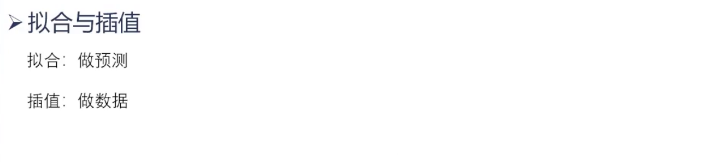

# 拟合与插值

## 拟合


## 插值
数据量太少了，所以找到一个函数，来扩大样本量


## 例题


## 代码实现
### matlab
<br/>

```matlab
%% 黄河小浪底调水调沙问题
%save('water.mat','water')
load('water.mat')
load('sand.mat')
t = []
for i = 1 : 24
    t = [t 3600*(12*i - 4)];   
end

total_sand = sand .* water; %排沙量

pp = spline(t,total_sand); %返回三次样条插值结果
f = @(t) ppval(pp,t);% 定义了一个匿名函数f，该函数使用ppval函数计算分段多项式的值。
                     % 这个匿名函数可以作为被积函数传递给MATLAB的integral函数，从而计算分段多项式的积分。

q = integral(f,t(1),t(24));% 被积函数、积分上下限

% 绘图看一看
subplot(1,2,1)
plot(water(1:11),total_sand(1:11),'*')
xlabel('水流量');
ylabel('排沙量');
title('第一阶段')
subplot(1,2,2)
plot(water(12:24),total_sand(12:24),'*')
xlabel('水流量');
ylabel('排沙量');
title('第二阶段');

% 拟合
x1 = water(1:11);
y1 = total_sand(1:11);
x2 = water(12:24);
y2 = total_sand(12:24);

```
运行结果：

在matlab中，可以直接通过工具，得到拟合函数和评估系数


### python
<br/>

```python
from scipy.optimize import linprog
from scipy.optimize import minimize
from pulp import LpMaximize, LpProblem, LpVariable
import networkx as nx
import matplotlib.pyplot as plt
import pandas as pd
from scipy.integrate import quad
from scipy.optimize import curve_fit
from scipy.integrate import odeint
import seaborn as sns
import numpy as np   #以上是导入必须的算法库

def func17():
    # 定义要拟合的函数形式
    def func(x, a, b, c):
        return a * np.exp(-b * x) + c

    # 生成一些带有噪声的示例数据
    x_data = np.linspace(0, 4, 50)
    y_data = func(x_data, 2.5, 1.3, 0.5) + 0.2 * np.random.normal(size=len(x_data))

    # 使用 curve_fit 进行拟合
    popt, pcov = curve_fit(func, x_data, y_data) # 先导入这个包：from scipy.optimize import curve_fit

    # 绘制原始数据和拟合结果
    plt.scatter(x_data, y_data, label='Original Data')
    plt.plot(x_data, func(x_data, *popt), 'r-', label='Fitted Curve')
    plt.legend()
    plt.xlabel('x')
    plt.ylabel('y')
    plt.title('Curve Fitting Example')
    plt.show()

    # 输出拟合参数
    print('拟合参数:', popt)
```

