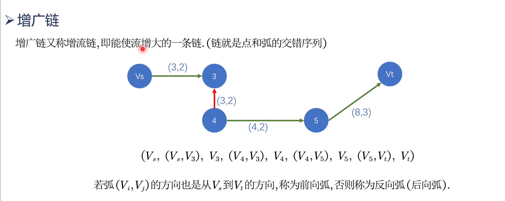
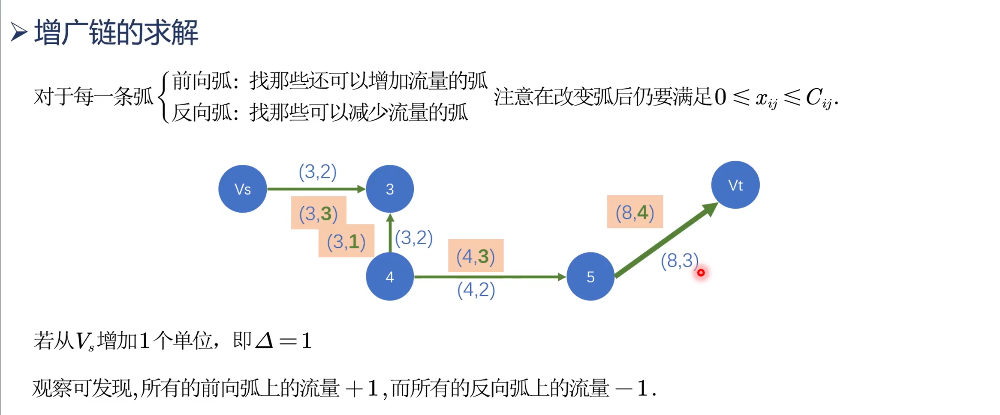
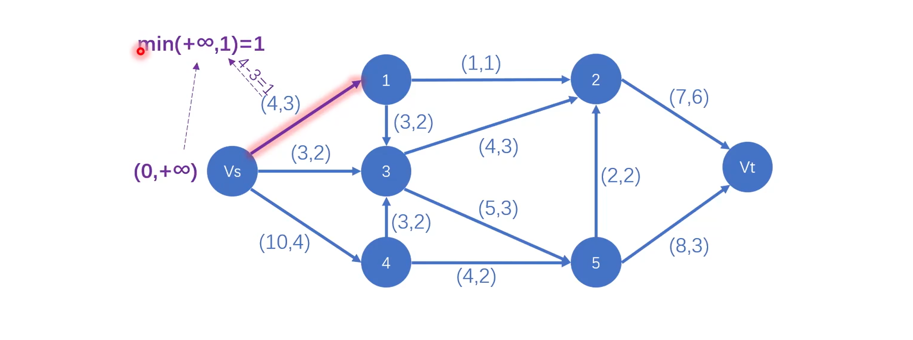
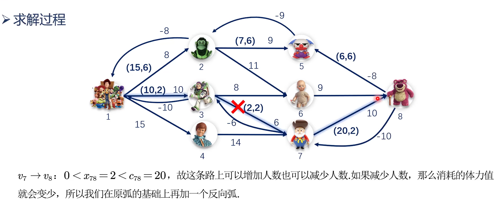

# 最大流问题

比如说，(4,3)表示当前这条路的最大容量是4，负载是3。

## 可行流
对于每个节点都是一样，必须满足发出的流量等于输入的流量。

## 增广链
增广链的表达式和方向是有关系的，具体关系如下图：


增加了VS的输入量，就下面这条链而言，每个节点的输出都增加了，因此，这条链就是增广链。

也要考虑限定条件，如果Vs增加2，那么超出了限定条件，VS的负载比最大容量大，因此不能这样做。


### 增广链与网络最大流
<br/>


这种算法与图论里面的迪杰斯特拉算法有异曲同工之妙。
### 实现过程
<br/>

#### 算法理论
<br/>

1. 把起点初始化为$(0,+\infty)$，含义是起点没有前向，而且起点可以无限输出能流。

2. 考察与起点直接相连的节点，比如这里考察节点1。节点1的关系是$(4,3)$，说明还可以增加一个单位的流量。将1和前一个节点的 $\infty$比较，取最小值，得到1。标记1节点为$(+\mathrm{vs},1)$，+vs表示1的前一个节点是vs，而且从0到1是前向弧。


3. 考察与节点1直接相连的节点，比如这里考察节点2，节点2的关系是$(1,1)$，说明已经无法增加流量了，不被纳入方案。

4. 考察与节点1直接相连的节点3，节点3的关系是$(3,2)$，说明还可以增加一个单位的流量，将1和前一个节点（即节点1）的标记$(+\mathrm{vs},1)$中的1比较，取最小值，即为1。标记节点3为$(+\mathrm{v1},1)$。


5. 重复以上步骤，直到终点vt被成功标记。


6. 算出可增加的量，即取所有标记的最小值。

7. 这条链就是增广链，它和原先相比，流量必然增加，因此，更新这条链的数据，得到下面这条链。

8. 接下来考量这条链是不是增广链。即重复1到7步，这里不再赘述，仅以图片展示。


原来总流量就是起点的输出值。


9. 与8同理


10. 与9同理


11. 与10同理


12. 总结


#### 代码实现
##### matlab
 ```matlab
%% 用标号法求解网络最大流问题
a = zeros(7);   %构造7*7矩阵，因为从0到6，一共有7个节点
a(1,2) = 4; a(1,4) = 3; a(1,5) = 10;  %输入每个直接相连节点之间能流的最大承载量
a(2,3) = 1; a(2,4) = 3; a(4,3) = 4;
a(5,4) = 3; a(4,6) = 5; a(5,6) = 4;
a(6,3) = 2; a(3,7) = 7; a(6,7) = 8;
b = sparse(a);%通过挤出任何零元素将满矩阵转换为稀疏格式
[MaxFlow FlowMatrix Cut] = graphmaxflow(b,1,7); % 计算网络最大流
view(biograph(a, [], 'ShowWeights', 'on')); % 绘制原图
view(biograph(FlowMatrix, [], 'ShowWeights', 'on')); % 绘制最大流图
```
输出结果：


##### python实现
```python
import networkx as nx
import matplotlib.pyplot as plt
plt.rcParams['font.sans-serif'] = ['Simhei']  # 显示中文
plt.rcParams['axes.unicode_minus'] = False  # 显示负号

def func10():
    # 创建有向图
    G = nx.DiGraph()

    # 添加带容量的边
    G.add_edge('Vs', '1', capacity=4, flow=3)   # Vs到1这条弧，容量为4，目前流为3
    G.add_edge('Vs', '3', capacity=3, flow=2)
    G.add_edge('Vs', '4', capacity=10, flow=4)
    G.add_edge('1', '2', capacity=1, flow=1)
    G.add_edge('1', '3', capacity=3, flow=2)
    G.add_edge('4', '3', capacity=3, flow=2)
    G.add_edge('4', '5', capacity=4, flow=2)
    G.add_edge('3', '2', capacity=4, flow=3)
    G.add_edge('3', '5', capacity=5, flow=3)
    G.add_edge('5', '2', capacity=2, flow=2)
    G.add_edge('5', 'Vt', capacity=8, flow=3)
    G.add_edge('2', 'Vt', capacity=7, flow=6)


    # 使用最大流算法求解最大流
    max_flow_value, max_flow_dict = nx.maximum_flow(G, 'Vs', 'Vt')

    # 打印结果
    print("最大流值:", max_flow_value)
    print("最大流分配:", max_flow_dict)

if __name__ == '__main__':
    func10()
```
输出结果：


# 最小费用最大流问题


只需要让所有人走相同的路径就行了。

但是，由于每条路都限制了通行人数，和Dijkstra算法相比，实际上多了一个维度。因此，需要把所有人分散到不同的道路上，分别去计算走过的路径和需要花费的体力值。
1. 首先要做的，就是派出一些人，前往一条通往终点的最短路径。根据之前的算法，先找出一条增广链。

2. 因为对于未满的弧来说，既可以增加流量，又可以减少流量。因此，给它们都增加了反向弧。对于满了的弧来说，只能减少流量，因此，把原先的弧去掉，只增加反向弧。


3. 完成这条增广链之后，可以得出派出多少人走这条链。

4. 继续找出增广链，重复这些步骤。




## 代码实现
#### matlab
<br/>

``` matlab
%%  定义floyd算法：
function [path, dis] = Floyd(gra)
    n = size(gra);
    dis = gra;
    path = zeros(n);
    for k  = 1 : n %这是跳板节点
        for i = 1 : n
            for j = 1 :n
                if (dis(i,k) + dis(k,j) < dis(i,j)) % 通过跳板发现了更短的路径，更新最短路径
                    dis(i,j) = dis(i,k) + dis(k,j);
                    path(i,j) = k;
                end
        end
    end
end


%% 求解最小费用最大流问题
% 图的邻接矩阵，即每段弧能承受的最大流量
c = [0 15 10 20 0 0 0 0;
     0 0 0 0 7 10 0 0;
     0 0 0 0 0 8 2 0;
     0 0 0 0 0 0 18 0;
     0 0 0 0 0 0 0 6;
     0 0 0 0 0 0 0 16;
     0 0 0 0 0 0 0 20;
     0 0 0 0 0 0 0 0;]

x = zeros(8); 

 cost = [+inf 8 10 15 +inf +inf +inf +inf;  %每段弧需要花费的体力（代价）
 +inf +inf +inf +inf 9 11 +inf +inf;
 +inf +inf +inf +inf +inf 8 6 +inf;
 +inf +inf +inf +inf +inf +inf 14 +inf;
 +inf +inf +inf +inf +inf +inf +inf 8;
 +inf +inf +inf +inf +inf +inf +inf 9;
 +inf +inf +inf +inf +inf +inf +inf 10;
 +inf +inf +inf +inf +inf +inf +inf +inf;]
 
cost_all = 0;

 %% 因为有负权值，不能用Dijkstra，我们这里用Floyd算法求解
 vec = input('请输入发点和终点（例如[1,8]）：');
 while (1)    
     [path, dis] = Floyd(cost); % 求最短路径
     mypath = [8];
     i = vec(1);  %起点
     j = vec(2);  %终点
     % 筛选出从发点到终点的路径
     while(path(i,j) ~= 0)
        j = path(i,j);
        mypath = [mypath j];%在原数组后追加元素
     end
     mypath = [1 fliplr(mypath)];% 翻转路径方便求解
     if(size(mypath,2) == 2) %此时再也找不到最短路径
         break;
     end
     % 求最短路上的增广链
     max_x = [+inf];
     for i = 2 : size(mypath,2) %计算增广链的delta
          max_x = [max_x min(max_x(i-1), c(mypath(i-1),mypath(i)) - x(mypath(i-1),mypath(i)))];
     end
     delta = min(max_x);
     for i = 2 : size(mypath,2)
          x(mypath(i-1),mypath(i)) = x(mypath(i-1),mypath(i)) + delta;% 对路径上的弧加流量
          cost_all = cost_all + delta*cost(mypath(i-1),mypath(i));% 计算总耗费
     end
     % 检查是否有反向弧
     for i = 2 : size(mypath,2)
          if(c(mypath(i-1),mypath(i)) == x(mypath(i-1),mypath(i))) % 弧上的流量已满
                cost(mypath(i),mypath(i-1)) = -1*cost(mypath(i-1),mypath(i)); % 增加一条反向弧
                % 取消原弧
                c(mypath(i-1),mypath(i)) = 0; 
                cost(mypath(i-1),mypath(i)) = +Inf;
          end
          if(x(mypath(i-1),mypath(i)) < c(mypath(i-1),mypath(i)) && 0 < x(mypath(i-1),mypath(i))) % 弧上的流量未满,且大于0
                cost(mypath(i),mypath(i-1)) = -1*cost(mypath(i-1),mypath(i)); % 增加一条反向弧
          end
     end
 end
 myplot(cost);

```
运行结果：

#### python
<br/>

```python
 from scipy.optimize import linprog
from scipy.optimize import minimize
from pulp import LpMaximize, LpProblem, LpVariable
import networkx as nx
import matplotlib.pyplot as plt
import pandas as pd
from scipy.integrate import quad
from scipy.optimize import curve_fit
from scipy.integrate import odeint
import seaborn as sns
import numpy as np   #以上是导入必须的算法库

def func12():
    # 容量矩阵
    c = [
        [0, 15, 10, 20, 0, 0, 0, 0],
        [0, 0, 0, 0, 7, 10, 0, 0],
        [0, 0, 0, 0, 0, 8, 2, 0],
        [0, 0, 0, 0, 0, 0, 18, 0],
        [0, 0, 0, 0, 0, 0, 0, 6],
        [0, 0, 0, 0, 0, 0, 0, 16],
        [0, 0, 0, 0, 0, 0, 0, 20],
        [0, 0, 0, 0, 0, 0, 0, 0]
    ]

    # 费用矩阵
    cost = [
        [float('inf'), 8, 10, 15, float('inf'), float('inf'), float('inf'), float('inf')],
        [float('inf'), float('inf'), float('inf'), float('inf'), 9, 11, float('inf'), float('inf')],
        [float('inf'), float('inf'), float('inf'), float('inf'), float('inf'), 8, 6, float('inf')],
        [float('inf'), float('inf'), float('inf'), float('inf'), float('inf'), float('inf'), 14, float('inf')],
        [float('inf'), float('inf'), float('inf'), float('inf'), float('inf'), float('inf'), float('inf'), 8],
        [float('inf'), float('inf'), float('inf'), float('inf'), float('inf'), float('inf'), float('inf'), 9],
        [float('inf'), float('inf'), float('inf'), float('inf'), float('inf'), float('inf'), float('inf'), 10],
        [float('inf'), float('inf'), float('inf'), float('inf'), float('inf'), float('inf'), float('inf'), float('inf')]
    ]

    # 创建空的有向图
    G = nx.DiGraph()

    # 遍历容量矩阵和费用矩阵，将非零元素作为边添加到图中
    for i in range(len(c)):
        for j in range(len(c[i])):
            if c[i][j] != 0:
                # 添加边并设置容量和费用属性
                G.add_edge(i, j, capacity=c[i][j], weight=cost[i][j])

    # 打印图的节点和边
    print("节点:", G.nodes())
    print("边:", G.edges(data=True))

    # 使用最小费用最大流算法求解
    flow_dict = nx.max_flow_min_cost(G, 0, 7)

    # 计算最小费用
    min_cost = nx.cost_of_flow(G, flow_dict)

    # 打印结果
    print("最小费用:", min_cost)
    print("最大流分配:", flow_dict)

    # 绘制有向网络图
    pos = {'s': (0, 5), 'v1': (2, 8), 'v2': (2, 6), 'v3': (2, 4), 'v4': (4, 8), 'v5': (4, 6), 'v6': (4, 4), 't': (6, 5)}  # 指定顶点绘图位置
    # 设置节点布局 https://networkx.org/documentation/stable/reference/generated/networkx.drawing.layout.spring_layout.html

    max_flow = {
        0: {1: 14, 2: 10, 3: 18},  # 最终：0和1相连，流量为14；0和2相连，流量为10；0和3相连，流量为18。
        1: {4: 6, 5: 8},   # 其他节点的表示方法和0节点一样，都是看和哪个节点相连，流量是多少。（有方向要求）
        2: {5: 8, 6: 2},
        3: {6: 18},
        4: {7: 6},
        5: {7: 16},
        6: {7: 20},
        7: {}
    }

    # 创建有向图
    G = nx.DiGraph()

    # 添加边和流量属性
    for u, neighbors in max_flow.items():    # u和neighbors是max_flow.items()的两个项。用items打开max_flow，发现有两种数据，第一种是0到7，第二种是大括号里面的数据。用u和neighbors分别去接收这些数据
        for v, flow in neighbors.items():    # 用items打开neighbors。即出现 1：4，2：10，3：18 这样类型的数据。用v记录下1，2，3···这些节点，用flow记录下14，10，18···这些流量
            G.add_edge(u, v, flow=flow, capacity=c[u][v])    # 用flow记录下每段弧的流量。用capacity记录下每段弧的最大容量

    # 成功分别存储好这些不同的数据包后，就可以开始绘制图形
    pos = nx.spring_layout(G)  # 设置节点布局
    nx.draw(G, pos, with_labels=True, node_color='lightblue', node_size=500)  # 绘制节点和边，定义了节点和边的类型

    # 绘制权重标签
    edge_labels = {(u, v): f"最大容量: {d['capacity']}\n流量: {d['flow']}"
                   for u, v, d in G.edges(data=True)}  # 把每段弧的起点u、终点v、最大容量和流量d作为一个数据结构，存储到G.edge中。d的数据是这样产生的：使用capacity和flow作为指引，查找数据
    nx.draw_networkx_edge_labels(G, pos, edge_labels=edge_labels, font_size=4)

    plt.title('Max Flow Allocation')  # 设置标题
    plt.show()  # 显示图形

```
运行结果：
